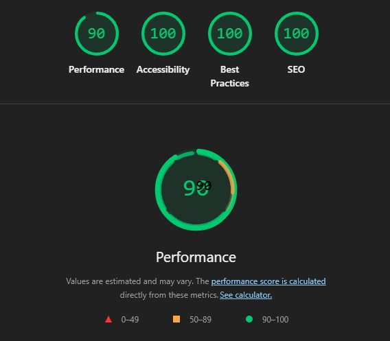
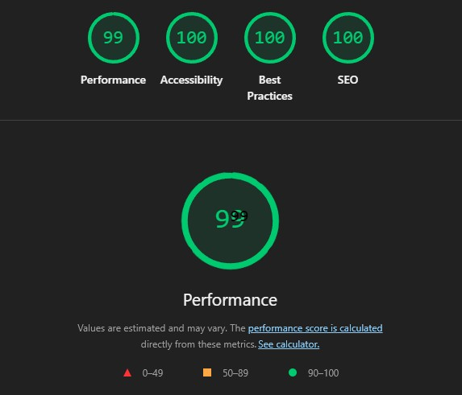

# Cosmic Flow

Interaktywna strona landing page dla inicjatywy kolonizacji Marsa. Użytkownik przemierza Układ Słoneczny — od Słońca przez kolejne planety aż do Marsa i sekcji z misją kolonizacyjną — dzięki animowanemu, scroll-driven interfejsowi.

---

URL: https://cosmic-flow.pages.dev

---
## Struktura projektu

```
cosmic-flow/
├── frontend/          # Aplikacja Next.js
└── backend/           # Serwer Express + SQLite
```

---

## Frontend

### Stack

| Technologia  | Wersja |
|--------------|--------|
| Next.js      | 16.2.2 |
| React        | 19.2.4 |
| TypeScript   | 5.x    |
| Tailwind CSS | 4.x    |

### Struktura `frontend/`

```
frontend/
├── app/                  # App Router (layout, strony, global CSS)
├── components/
│   ├── sections/         # Sekcje strony (Header, Sun, Mercury, Venus, EarthMoon, Mars, Colony)
│   └── utils/            # Komponenty pomocnicze (Scrollbar, SectionNav, HamburgerNav, DonationModal)
├── styles/               # Pliki CSS per sekcja
├── Images/               # Grafiki (tła, planety)
└── public/               # Pliki statyczne
```

### Uruchomienie

```bash
cd frontend
npm install
npm run dev
```

Aplikacja dostępna pod `http://localhost:3000`.

> Zmienna środowiskowa `NEXT_PUBLIC_API_URL` (plik `.env.local`) wskazuje adres backendu.
> Domyślnie: `http://localhost:4000`.

---

## Lighthouse

| Mobile | Desktop |
|--------|---------|
|  |  |

---

## Backend

### Stack

| Technologia     | Wersja |
|-----------------|--------|
| Node.js         | 22.x   |
| Express         | 4.x    |
| TypeScript      | 5.x    |
| SQLite (libSQL) | —      |

### Struktura `backend/`

```
backend/
├── src/
│   ├── index.ts          # Punkt wejścia — Express, CORS, start serwera
│   ├── db.ts             # Inicjalizacja bazy danych i seed
│   └── routes/
│       └── mission.ts    # Endpointy /api/mission i /api/support
├── cosmic-flow.db        # Plik bazy danych SQLite (generowany automatycznie)
├── .env.example
├── package.json
└── tsconfig.json
```

### Baza danych

Dwie tabele, łącznie **12 rekordów** po pierwszym uruchomieniu:

| Tabela           | Rekordy | Zawartość                                      |
|------------------|---------|------------------------------------------------|
| `mission_config` | 7       | Parametry misji (cel, rok startu, faza, itd.)  |
| `donations`      | 5+      | Wpłaty wspierających (dodawane przez formularz) |

### Endpointy API

| Metoda | Ścieżka        | Opis                                                       |
|--------|----------------|------------------------------------------------------------|
| GET    | `/api/mission` | Zwraca dane misji: finansowanie, top donatorzy, statystyki |
| POST   | `/api/support` | Dodaje nową wpłatę `{ name, amount }` do bazy              |

Odpowiedź `GET /api/mission`:

```json
{
  "funding": { "raised": 284729300, "goal": 500000000, "supporters": 482100 },
  "topDonors": [
    { "rank": 1, "name": "E. Musk", "amount": 25000000 }
  ],
  "launchYear": "2040",
  "colonists": "1,000",
  "phase": "Alpha",
  "duration": "10 Years"
}
```

### Uruchomienie

```bash
cd backend
cp .env.example .env   # opcjonalnie — domyślny port to 4000
npm install
npm run dev
```

Serwer dostępny pod `http://localhost:4000`.


